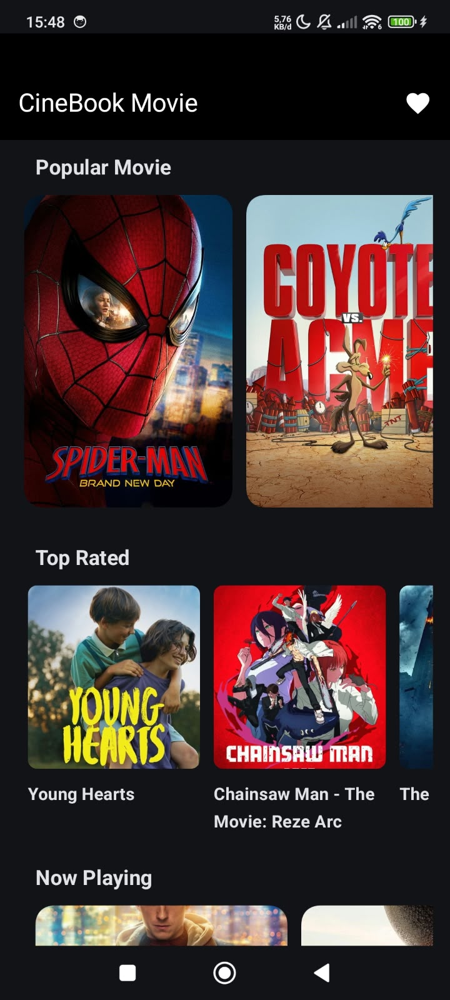
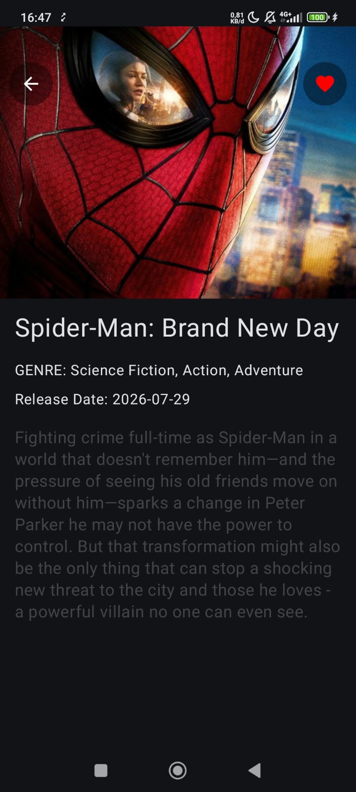
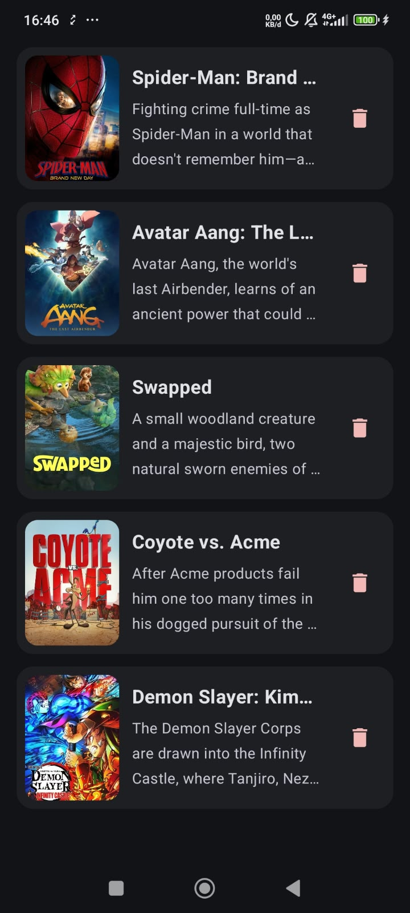
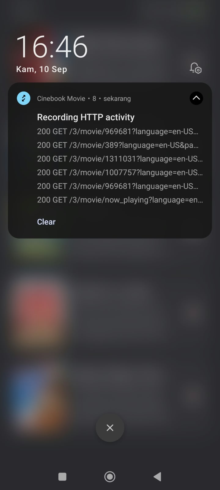

# 🎬 CineBook Movie App

CineBook Movie adalah aplikasi Android modern yang digunakan untuk menjelajahi katalog film terkini, melihat detail film, dan menyimpan film favorit Anda ke dalam penyimpanan lokal. Aplikasi ini dibangun dengan standar arsitektur Android modern (*Modern Android Development*) menggunakan Jetpack Compose, Clean Architecture, dan Room Database.

---

## 🛠️ Tech Stack & Libraries

Proyek ini dibangun menggunakan *stack* teknologi Android terbaru:

- **Language:** [Kotlin](https://kotlinlang.org/)
- **UI Framework:** [Jetpack Compose](https://developer.android.com/jetpack/compose) (Declarative UI)
- **Architecture:** Clean Architecture & MVVM (Model-View-ViewModel)
- **Dependency Injection:** [Hilt / Dagger](https://dagger.dev/hilt/)
- **Local Database:** [Room Database](https://developer.android.com/training/data-storage/room) dengan KSP Compiler
- **Asynchronous & Reactive:** Kotlin Coroutines & Flow
- **Network / API Client:** [Retrofit2](https://square.github.io/retrofit/) & [OkHttp3](https://square.github.io/okhttp/)
- **Chucker Http Inspector**
- **Image Loading:** [Coil](https://coil-kt.github.io/coil/) (Coil Compose)
- **Navigation:** Jetpack Compose Navigation

---

## 🚀 Cara Instalasi & Menjalankan Proyek

### Prasyarat
- **Android Studio:** Studio Ladybug / Jellyfish (disarankan versi terbaru).
- **JDK:** OpenJDK 17 atau lebih baru.
- **TMDB API Key:** Buat akun di [The Movie Database (TMDB)](https://www.themoviedb.org/) untuk mendapatkan API Access Token / Bearer Token.

### Langkah-Langkah

1. **Clone Repositori**
   ```bash
   git clone https://github.com/Anggasayogo/cinebook-movie.git
   cd CineBookMovie
1. **Update Local Propertis**
   ```bash
   TMDB_TOKEN = Bearer yourtoken..
---
## 📦  Feature List

1. **Popular Movie List**
2. **Top Rated Movie List**
3. **Now Playing Movie List**
4. **Detail Movie**
5. **Favorite Movie List**


| HomeScreen | DetailScreen | FavoriteScreen | ChuckerInspect |
| :---: | :---: | :---: | :---: |
|  |  |  |  |